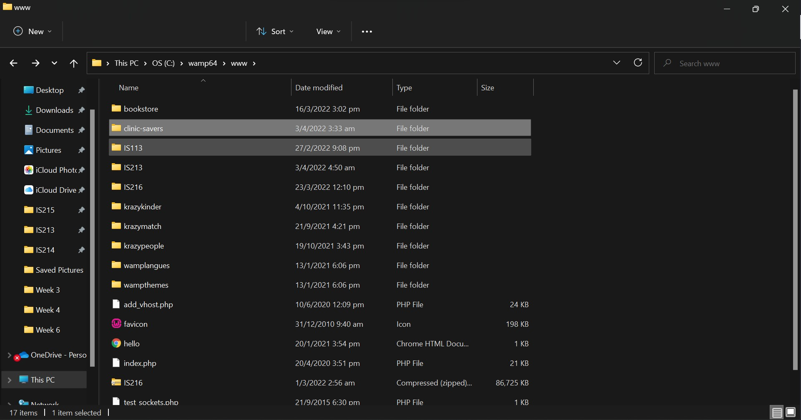

# Clinic-savers #

Clinic-savers is an enterprise solution that provides a multi-functional application for clinic staff as well as patients. Through our clinic management system and quick booking system, users will be able to access various microservices that can help streamline many of the current user processes found in clinics.

## Prerequisites ##

To ensure Mailjet API is functioning within Notification microservice, navigate to ```clinic-savers``` directory and enter the following command in command prompt/terminal.

   1. For Windows users

       ```
       pip install mailjet_rest
       ```
    
   2. For Mac users

       ```
       python3 -m pip install mailjet_rest
       ```

## Access to database ##

Our MySQL databases are managed by phpMyAdmin. In order to access the databases:

   1. Launch WAMP/MAMP server and access phpMyAdmin through this URL http://localhost/phpmyadmin/

      1. Login credentials for Windows users

         Username: root<br>
         No password required<br>

      2. Login credentials for Mac users

         Username: root<br>
         Password: root<br>

   2. Navigate to the Import tab

      

   3. Click on "Choose File" and navigate to ```database``` directory in ```clinic-savers``` respository.

      * Install the following database schemes as shown below

        

      * Click on "Go" on the bottom right

        

   4. The following message will appear if the database has been successfully imported.

      


## Running the microservices with Docker ##

We have utilised Docker Compose to deploy mutiple microservice docker containers at once.

Navigate to ```clinic-savers``` directory and enter the following command in command prompt/terminal.

```
docker-compose up
```

All of our microservices will be deployed as Docker containers.


## Features of our application ##

1. Patient http://localhost/clinic-savers/frontend/patientUIcopy.html

   * Utilising Google Distance Matrix API to locate a clinic nearest to you.  

   * Make an appointment

   * Filter through the appointments you have made by entering a date.


2. Clinic http://localhost/clinic-savers/frontend/clinicLogin.html

   * Please enter the following login credentials for testing purposes:

      * Username: staff

      * Password: 12345

   * Clinic staff will be able to access our application to perform the following tasks:

      * Prescribe drugs

      * Restock drugs

      * View patient records

   * With the help of Mailjet API, the supplier will be notified through email whenever there is a low supply of drugs.


## Access to Frontend UI ##

The patient user process first begins at the [Patient Login Page](http://localhost/patient_login/files/patientLogin.html) where they can login using their NRIC. From then on, patients can access the other services such as finding nearby clinics as well as viewing their appointments.

The clinic staff user process first begins at the [Clinic Login Page](http://localhost/clinic-savers/frontend/clinicLogin.html) where they can login using a username and password. Clinic staff will then be able to access the other services such as prescribing drugs, restocking drugs and viewing patient records.


<br><br>
For the frontend files to function, clinic-savers repository has to be saved in the webroot.



<br><br>
Our frontend webpages can be accessed through these links:

* Clinic login: http://localhost/clinic-savers/frontend/clinicLogin.html
* Patient login: http://localhost/patient_login/files/patientLogin.html
* User type selection: http://localhost/clinic-savers/frontend/user.html
* Appointment booking: http://localhost/clinic-savers/frontend/patientUIcopy.html
* Appointment record: http://localhost/clinic-savers/frontend/viewAppointments.html
* Patient records: http://localhost/clinic-savers/frontend/patientRecords.html
* Drug prescription: http://localhost/clinic-savers/frontend/prescribeDrug.html
* Drug restocking: http://localhost/clinic-savers/frontend/restock.html
* Subsidy card information: http://localhost/clinic-savers/frontend/subsidyCard.html

## Course and Team Information ##

IS213 Enterprise Solution Development<br>
AY2021-2022, Term 2<br>
Section 4<br>
Team 5

## Authors ##

* Bryan Shing Wen Yan bryan.shing.2020@scis.smu.edu.sg<br>
* Earnest Ho Jay En earnestho.2020@scis.smu.edu.sg<br>
* Jann Chia Rui Qi jann.chia.2020@scis.smu.edu.sg<br>
* Wong Jing Yun jy.wong.2020@scis.smu.edu.sg<br>
* Yeo Jing Yi jingyi.yeo.2020@scis.smu.edu.sg

## Acknowledgement ##

* Professor: Alan Megargel
* Instructor: Thiang Lay Foo
