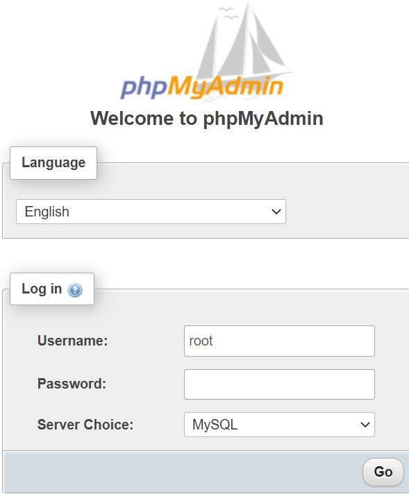
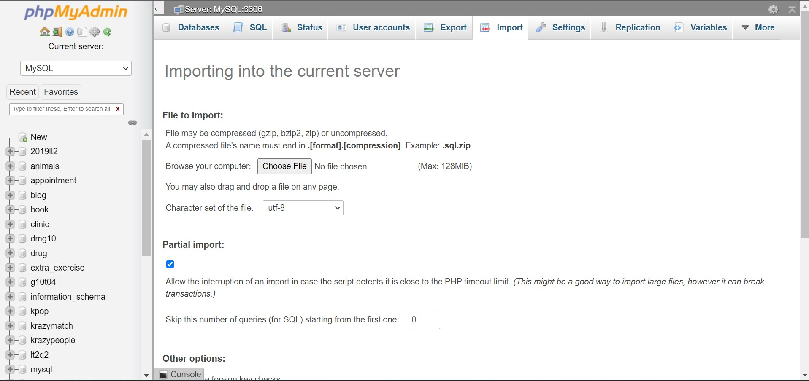
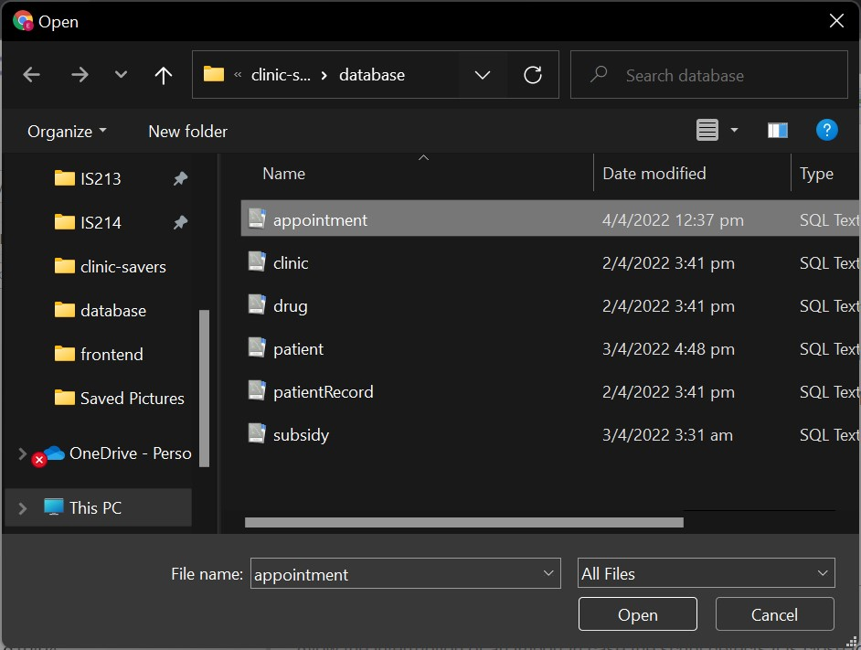
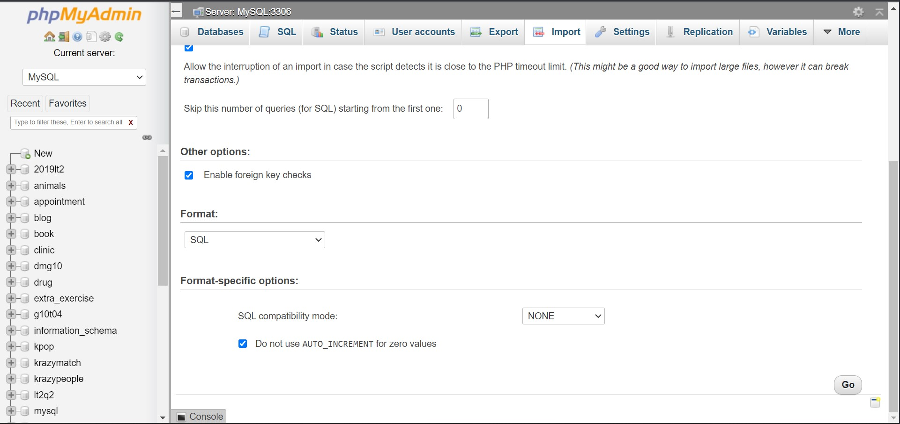
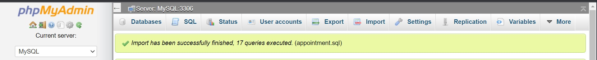

# clinic-savers

## Prerequisites ##

To ensure Mailjet API is functioning within Notification microservice, navigate to ```clinic-savers``` directory and enter the following command in command prompt/terminal.

   1. For Windows users

       ```
       pip install mailjet_rest
       ```
    
   2. For Mac users

       ```
       python3 -m pip install mailjet_rest
       ```

## Access to database ##

Our databases are set up with phpMyAdmin. In order to access the databases:

   1. Launch WAMP/MAMP server and access phpMyAdmin through this URL http://localhost/phpmyadmin/

      1. Login credentials for Windows users

         Username: root<br>
         No password required
         

      2. Login credentials for Mac users
   
   2. Navigate to the Import tab

      

   3. Click on "Choose File" and navigate to ```database``` directory in ```clinic-savers``` respository.

      * Install the following database schemes as shown below

        

      * Click on "Go" on the bottom right

        

   4. The following message will appear if the database has been successfully imported.

      


## Running the microservices with Docker ##

We have utilised Docker Compose to deploy mutiple microservice docker containers at once.

Navigate to ```clinic-savers``` directory and enter the following command in command prompt/terminal.

```
docker-compose up
```

All of our microservices will be deployed as Docker containers.


## Access to Frontend UI ##
add process of user journey (order in which the pages will be accessed)

<br><br>
For the frontend files to function, clinic-savers repository has to be saved in the webroot.


<br><br>
Our frontend webpages can be accessed through these links:

* Clinic login: http://localhost/clinic-savers/frontend/clinicLogin.html
* Patient login: http://localhost:3001
* User type selection: http://localhost/clinic-savers/frontend/user.html
* Appointment booking: http://localhost/clinic-savers/frontend/patientUI.html
* Appointment record: http://localhost/clinic-savers/frontend/viewAppointments.html
* Patient records: http://localhost/clinic-savers/frontend/patientRecords.html
* Drug prescription: http://localhost/clinic-savers/frontend/prescribeDrug.html
* Drug restocking: http://localhost/clinic-savers/frontend/restock.html
* Subsidy card information: http://localhost/clinic-savers/frontend/subsidyCard.html

## Course and Team Information ##

IS213 Enterprise Solution Development<br>
AY2021-2022, Term 2<br>
Section 4<br>
Team 5

## Authors ##

* Bryan Shing Wen Yan bryan.shing.2020@scis.smu.edu.sg<br>
* Earnest Ho Jay En earnestho.2020@scis.smu.edu.sg<br>
* Jann Chia Rui Qi jann.chia.2020@scis.smu.edu.sg<br>
* Wong Jing Yun jy.wong.2020@scis.smu.edu.sg<br>
* Yeo Jing Yi jingyi.yeo.2020@scis.smu.edu.sg

## Acknowledgement ##

* Professor: Alan Megargel
* Instructor: Thiang Lay Foo
